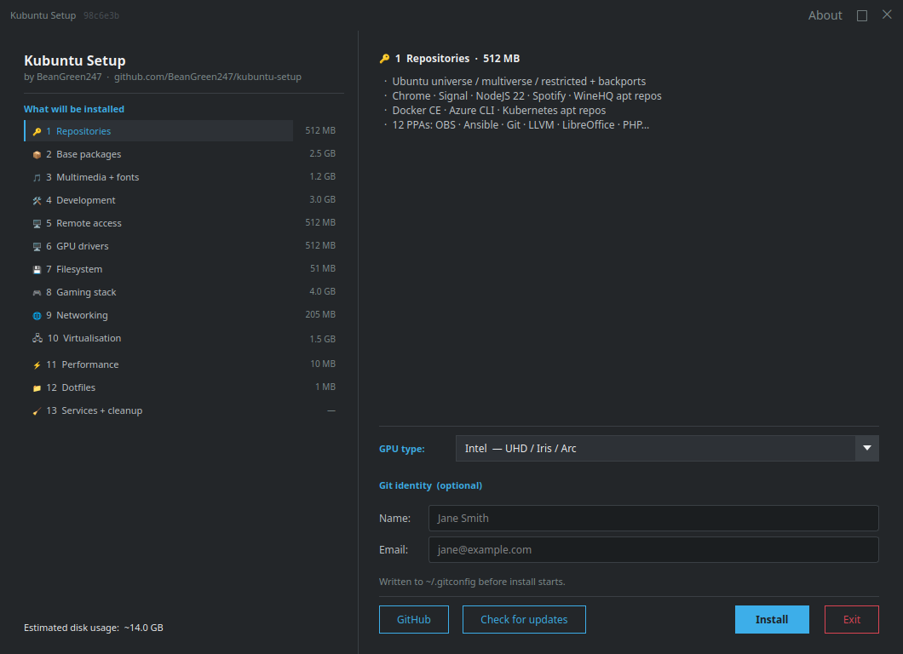
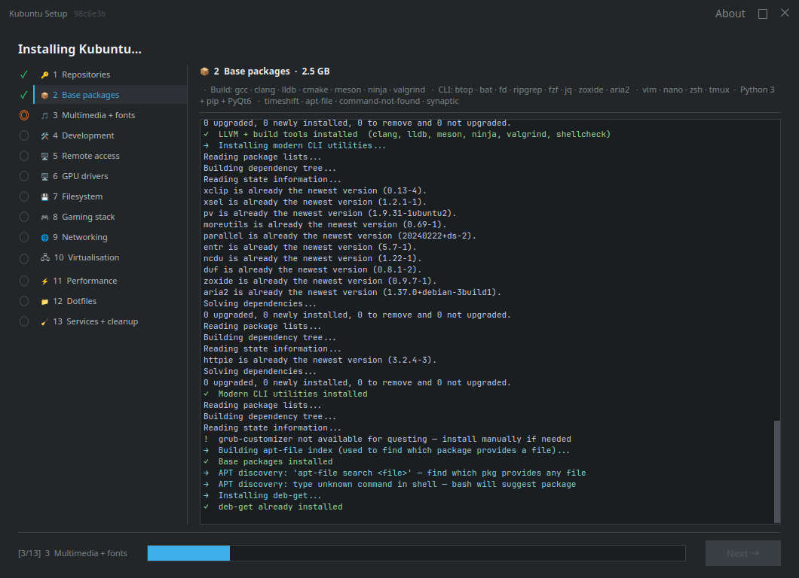

# kubuntu-setup

Kubuntu setup tool for gaming + development + IT infrastructure by [BeanGreen247](https://github.com/BeanGreen247).

Includes a GUI installer, a self-update mechanism with desktop notifications, a dotfile sync daemon, and a weekly apt key refresh service.

## Compatibility

Tested on **Kubuntu 26.04 LTS "Resolute Raccoon"** and **Kubuntu 25.10 "Questing Quetzal"** — Plasma 6, KWin 6, x86_64.

### Supported hardware

| Category | Supported | Notes |
|---|---|---|
| **CPU** | Any x86_64 | Schedutil governor applied; Intel thermald enabled for Intel CPUs |
| **Intel GPU** | Gen 8 (Broadwell) and newer — UHD 6xx, Iris Plus/Xe, Arc | iHD VA-API driver; Gen 7 and older fall back to `i965` (not configured) |
| **AMD GPU** | GCN 1.0+ (HD 7000 series) through RDNA 4 | Radeonsi VA-API; OverDrive ppfeaturemask enabled for RDNA 2+ |
| **NVIDIA GPU — proprietary** | Kepler (600/700 series) through current RTX 50 series | Driver selected via Kubuntu Driver Manager; NVDEC hardware decode requires Maxwell (900 series) or newer |
| **NVIDIA GPU — NVK (open)** | Turing (RTX 20 series) and newer recommended | NVK Vulkan driver is production-quality on Turing+; Volta and older have limited Vulkan support; VA-API decode via Nouveau is generation-limited |
| **VM / virtio-gpu** | QEMU/KVM with virtio-gpu or SPICE | Mesa virgl; `open-vm-tools` for VMware, VirtualBox guest additions for Oracle |
| **RAM** | 4 GB minimum, 8 GB recommended | zram 4 GB + swapfile 2 GB configured |
| **Storage** | Any SATA/NVMe SSD or HDD | ~14 GB free space required for full install; `fstrim.timer` enabled for SSDs |
| **Network** | Wired or Wi-Fi (kernel driver) | `iwlwifi power_save=0` applied for Intel Wi-Fi; no proprietary Wi-Fi firmware installed |
| **Display** | Any resolution, single or multi-monitor | KWin compositor; Wayland not tested — X11 session assumed |

### OS fallback behaviour

The script is tested on `resolute` (26.04) and `questing` (25.10). Most packages install fine on other Ubuntu releases; known caveats are handled with graceful fallbacks:

| Component | Fallback |
|---|---|
| WineHQ apt repo | Ubuntu `wine` package |
| Azure CLI repo | `noble` suite if `resolute`/`questing` not published |
| OBS Studio PPA | Ubuntu universe `obs-studio` |
| deadsnakes PPA | Skipped (Python 3.13 in Ubuntu 25.10/26.04 main) |
| All PPAs | `_add_ppa()` wraps each with `\|\| warn` — non-fatal |
| Docker CE | `docker.io` |

---

## Quick start

### Prerequisites

Before launching the installer, make sure the GUI dependency is present:

```bash
sudo apt install -y python3-pyqt6
```

> The `install.sh` one-liner below installs this automatically. If you cloned the repo manually, run the line above first.

### Option A — one-liner (recommended for fresh installs)

```bash
# Clones the repo, installs python3-pyqt6, registers desktop entry + daily update-checker:
bash <(curl -fsSL https://raw.githubusercontent.com/BeanGreen247/kubuntu-setup/main/install.sh)
```

Then open **Kubuntu Setup** from the KDE app launcher.

### Option B — manual clone

```bash
git clone https://github.com/BeanGreen247/kubuntu-setup.git ~/kubuntu-setup
cd ~/kubuntu-setup
chmod +x launch-installer.sh   # make the launcher executable (required)
./launch-installer.sh          # double-click in Dolphin works too
```

## Files

| File | Purpose |
|---|---|
| `install.sh` | Install or update the tool — clone/pull, register desktop entry and systemd timer |
| `setup-installer.py` | PyQt6 GUI launcher for `setup-kubuntu.sh` — changelog splash on startup, shows what will be installed, disk estimates, GPU selector, live per-step log |
| `setup-kubuntu.sh` | Main install script — 15 sections, non-interactive when launched from the GUI |
| `CHANGELOG.md` | Full version history — also shown in the installer splash on startup |
| `launch-installer.sh` | Thin shell wrapper for double-click launching from Dolphin |
| `update-checker.sh` | Runs daily via systemd user timer — sends a KDE notification when upstream commits are available |
| `post-login-setup.py` | PyQt6 GUI that runs on first login — Wine prefix init, KWin/power tuning, full KDE appearance + panel config |
| `dotfile-sync.py` | CLI daemon: pulls dotfiles from [BeanGreen247/dotfiles](https://github.com/BeanGreen247/dotfiles) on a 12 h schedule |
| `dotfile-sync-tray.py` | KDE system-tray indicator for dotfile-sync — shows status, notifies on updates, "Sync Now" / "Force Sync" buttons, GitHub link |
| `apt-key-refresh.sh` | Validates and refreshes all third-party apt signing keys — weekly systemd timer + boot trigger |
| `infra-connections.py` | KDE system-tray indicator for Tailscale + ZeroTier — shows IP, peers, network state, colour-coded log, GitHub link |
| `redeploy-tools.sh` | Clean-redeploy script — stops running processes, removes old binaries, copies fresh ones from the repo, restarts tray tools |

## Usage

### GUI (recommended)

The preferred way to launch is via `launch-installer.sh` — it handles the Python interpreter lookup and gives a readable error dialog if something is missing:

```bash
chmod +x ~/kubuntu-setup/launch-installer.sh   # only needed once
~/kubuntu-setup/launch-installer.sh
```

You can also double-click `launch-installer.sh` directly in Dolphin (right-click → **Run in Konsole** or mark as executable first via Properties → Permissions).

> **Dependency note:** The GUI requires `python3-pyqt6`. The tray tools (`dotfile-sync-tray.py`, `infra-connections.py`) additionally need `python3-pyqt6` to be installed. Run `sudo apt install -y python3-pyqt6` if you skipped `install.sh`.

The welcome screen lists all 15 install groups with estimated disk usage (~14.3 GB total). Select your **GPU type** and **install profile**, then click **Install**. `pkexec` handles root elevation — no terminal needed. Click **Help** in the title bar to read this documentation inside the app.



During installation, click any step in the left panel to see its live log output. A progress bar tracks overall completion.



### Terminal

```bash
sudo bash ~/kubuntu-setup/setup-kubuntu.sh
```

The script asks two questions when run directly in a terminal:

1. **GPU type** — `amd` / `nvidia` / `nvk` / `intel` / `vm`
2. **Confirmation** — summary is printed, press `y` to continue

When launched from the GUI both questions are skipped (answers passed as `--gpu=TYPE --yes`).

### Install profiles

Pass `--profile=NAME` on the command line, or select a profile from the dropdown in the GUI installer.

| Profile | Sections run | Use case |
|---|---|---|
| `full` | 1–15 | Everything — fresh Kubuntu gaming + dev + IT workstation |
| `full-no-infra` | 1–4, 6–9, 12–15\* | Gaming + dev workstation without remote access / VPN / virt |
| `full-no-dotfiles` | 1–12, 14–15 | Full install, skip dotfile sync (manage dotfiles manually) |
| `full-no-infra-no-dotfiles` | 1–4, 6–9, 12, 14–15 | Gaming + dev only, no infra and no dotfile sync |
| `infra` | 1–8, 10–15† | Dev + IT box — no gaming stack (Wine/Steam/launchers) |
| `dotfiles` | 13 only | Sync dotfiles on an already-configured machine |

\* Sections 5 / 10 / 11 skipped; xrdp / libvirtd / tailscaled / zerotier-one service enables in section 15 also skipped.
† Section 9 (gaming stack) and gaming-env portion of section 12 (shader cache, Wine/Proton env vars) skipped; perf hardening portion of section 12 runs.

### Post-login setup

After the script finishes, **reboot**. On first login KDE automatically opens the post-login setup GUI (Wine prefix init, KWin/power tuning, dark mode, launcher, panel cleanup, clock seconds). When all steps complete a **30-second auto-reboot countdown** starts — click **Cancel Reboot** to stay, or let it count down. The autostart entry removes itself after running.

To re-run manually:

```bash
bash ~/.local/bin/setup-kubuntu.sh --post-login
```

### Updating the tool

```bash
bash ~/kubuntu-setup/install.sh
```

Output tells you whether `setup-kubuntu.sh` changed (re-run installer recommended) or only tooling/config changed (no re-run needed). A daily background check sends a KDE notification when new commits are available on `origin/main`.

The **Check for updates** button in the GUI also does an in-process `git fetch` and shows the changelog in the detail panel.

---

## What gets installed

### 1 — Repositories
- Ubuntu `universe`, `multiverse`, `restricted`, backports
- Third-party apt repos: Google Chrome · Signal · NodeSource · Spotify · WineHQ · Docker CE · Azure CLI · Kubernetes · VS Code · Trivy · Tailscale · ZeroTier
- PPAs: OBS Studio · Ansible · Git · LLVM · LibreOffice · PHP · Go · and more
- **Upgrade-migration healing** — an OS upgrade (e.g. 25.10 → 26.04) disables `.list` files it cannot auto-migrate and sets `Enabled: no` in any DEB822 file it rewrites; the script detects and repairs all affected repos (VS Code, Docker, Kubernetes, Tailscale, Trivy, ZeroTier) on re-run even when the tools are already installed

### 2 — Base packages
- Build tools: `gcc`, `clang`, `lldb`, `meson`, `ninja`, `cmake`, `valgrind`, `shellcheck`
- CLI utilities: `btop`, `bat`, `fd`, `ripgrep`, `fzf`, `jq`, `zoxide`, `aria2`, `moreutils`, `parallel`, `httpie`, `tldr`, `sops` (GitHub release install — not in Ubuntu repos)
- `vim`, `nano`, `zsh`, `tmux`, `python3`, `pip`, `python3-pyqt6`, `software-properties-qt`
- `timeshift`, `apt-file`, `command-not-found`, `synaptic`
- CPU/power: `cpufrequtils`, `irqbalance`, `zram-tools`, `preload`, `power-profiles-daemon`, `thermald`

### 3 — Multimedia + fonts
- `ubuntu-restricted-extras`, `ffmpeg`, full GStreamer stack, VA-API libs
- `mpv`, `VLC`, `pavucontrol`
- KDE extras: `kdialog`, `plasma-systemmonitor`, `okular`, `ark`
- `plasma-browser-integration` **removed** — apt-pinned to `-1` and native messaging manifests cleared to prevent Brave/Chrome from re-activating it on every launch
- Fonts: JetBrains Mono, Fira Code, Noto CJK, Ubuntu, Roboto
- **Oxygen theme + extra wallpapers removed** — `kde-style-oxygen-qt6`, `kwin-decoration-oxygen`, `plasma-theme-oxygen`, `liboxygenstyle6*`, `kubuntu-wallpapers`, `plasma-workspace-wallpapers`, `plasma-wallpapers-addons` purged; only Breeze / Breeze Dark kept; `oxygen-sounds` is **intentionally kept** — it is a hard `Depends` of `plasma-desktop` and purging it cascades to removing all panel plasmoids
- **SDDM** switched to upstream Breeze theme with a solid black `#000000` background (no wallpaper image at login screen)
- **Plymouth** branded themes purged; boot theme set to `text`; `splash` removed from GRUB cmdline so no animated splash renders at boot
- **Cursor** set to Breeze Dark system-wide (login screen, root apps, Xresources)

### 4 — Development
- **Zed** — native, GPU-accelerated editor (official installer → `~/.local/bin/zed`)
- **VS Code** (Microsoft apt repo)
- **Docker CE** + compose plugin (docker.com repo, `docker.io` fallback)
- **Ansible**, **kubectl**, **Azure CLI**
- **Node.js 22 LTS**, **Go**, **PHP 8.x**
- Python: `proxmoxer`, `netmiko`, `napalm`, `boto3`, `paramiko`, `ansible-runner`
- **Wireshark**, `lynis`, `clamav` (on-demand; `clamd` masked — saves ~1 GB RAM; run `clamscan` manually), `podman`, `skopeo`
- **UFW firewall** — enabled, default-deny inbound; SSH/22 open globally; KDE Connect on LAN; Tailscale (`tailscale0`) and ZeroTier (`zt+`) interfaces fully allowed
- **fail2ban** — `sshd` and `xrdp` jails active (4 retries → 2-hour ban); custom xrdp filter included

### 5 — Remote access
- **xrdp** — RDP server on port 3389, KDE Plasma X11 session
- **FreeRDP3** (`xfreerdp3` + Wayland), **TigerVNC**, **KRDC**
- RDP port restricted by UFW to VPN subnets only: Tailscale (`100.64.0.0/10`) and ZeroTier (`192.168.192.0/24`)

```bash
mstsc /v:HOST                                                        # from Windows
xfreerdp3 /v:HOST /u:USER /p:PASS /w:1920 /h:1080 +clipboard        # from terminal
```

### 6 — GPU drivers

All GPU branches add the current user to the `video` and `render` groups so KDE System Monitor can read GPU usage and VA-API / Vulkan tools can access `/dev/dri/` devices.

| Option | What gets installed |
|---|---|
| `intel` | Mesa, `xorg-video-intel`, `intel-media-va-driver` (iHD), `mesa-va-drivers`, `LIBVA_DRIVER_NAME=iHD`, `VDPAU_DRIVER=va_gl` in `/etc/environment`, VA-API flags for Brave/Chrome/Chromium, `mpv hwdec=vaapi`, `thermald`, i915 FBC+PSR+GuC modprobe options |
| `amd` | Mesa, `vulkan-radeon`, `mesa-va-drivers`, `LIBVA_DRIVER_NAME=radeonsi`, `VDPAU_DRIVER=radeonsi` in `/etc/environment`, VA-API flags for Brave/Chrome/Chromium, `mpv hwdec=vaapi`, `amd64-microcode`, `radeontop`, amdgpu OverDrive modprobe |
| `nvidia` | Opens **Additional Drivers** (KDE app launcher → Settings → Hardware → Additional Drivers, or run `software-properties-qt`) — user selects driver; `VDPAU_DRIVER=nvidia`, `NVD_BACKEND=direct` in `/etc/environment`, `mpv hwdec=nvdec`, browser GPU decode flags, performance modprobe options |
| `nvk` | Opens Additional Drivers to confirm open-source selection; Mesa NVK userspace — `mesa-vulkan-drivers`, `mesa-va-drivers`, `xserver-xorg-video-nouveau`; proprietary NVIDIA modules blacklisted; `LIBVA_DRIVER_NAME=nouveau`; `mpv hwdec=vaapi`; browser GPU rasterization flags |
| `vm` | Mesa virgl, `qemu-guest-agent`, SPICE/VirtIO display |

#### Hybrid GPU switching (laptop iGPU + dGPU)

Use `envycontrol` or `prime-select` directly from the terminal.
See `gpu-setup-commands.txt` in this repo for the full command reference.

### 7 — Filesystem
- `ntfs-3g` (NTFS read/write), `exfatprogs` (exFAT)
- Samba/CIFS: `smbclient`, `cifs-utils`, `gvfs-backends`

### 8 — Gaming stack
- **Wine** WoW64-staging (WineHQ apt repo) + `winetricks`
- **Steam** + 32/64-bit runtime libs
- **DXVK** + `libvkd3d1` / `libvkd3d1:i386` (native Wine D3D; Proton-GE also bundles its own)
- **Proton-GE** → `~/.local/share/Steam/compatibilitytools.d/`
- **Wine-GE** → Heroic + Lutris runner dirs
- **Discord**, **Heroic Games Launcher**, **Lutris**
- **MangoHud**, **GameMode**, **GOverlay**
- **gamescope** (Valve micro-compositor — forced fullscreen, resolution scaling)
- **vkbasalt** + `vkbasalt:i386` (Vulkan post-processing: CAS sharpening, SMAA, FXAA)
- **input-remapper** + systemd service (kernel-level gamepad/wheel remapping)
- **switcheroo-control** (D-Bus service for hybrid GPU dGPU switching, used by Lutris/Heroic)
- **s-tui** (terminal thermal + clock monitor)
- **libadwaita** + **libappindicator** runtime libs (prevents missing-lib errors in Flatpak launchers)
- **ProtonUp-Qt** via Flathub (GUI to keep Proton-GE/Wine-GE up to date after install)
- **Flatseal** via Flathub (Flatpak sandbox permission manager)
- KWin gaming-performance script (blocks compositing for fullscreen windows)

Steam launch option: `mangohud --dlsym gamemoderun %command%`
> `--dlsym` is required for OpenGL games and Steam's Linux Runtime container; skip it only for native Vulkan titles.

**Steam built-in performance overlay (no install needed):**
> Steam → Settings → In Game → **Show performance monitor** → pick a corner, set **Performance detail level** to *FPS, CPU, GPU & RAM Full Details*. Works inside Steam's runtime where MangoHud may not inject correctly. Toggle in-game with the key set under *Toggle performance monitor key(s)*.

### 9 — Networking
- **Tailscale** (official apt repo)
- **ZeroTier** (official apt repo)

### 10 — Virtualisation
- `virt-manager` + `qemu-system-x86` + `libvirt` + `ovmf` (UEFI)
- User added to `libvirt` and `kvm` groups

### 11 — Performance hardening

> **RAM monitoring** — `setup-kubuntu.sh` rewrites KDE System Monitor to three pages: **Overview** (CPU total | GPU, CPU cores full-width, combined RAM linechart with App RAM/Cache/Swap, Network), **Disks** (partition space bars + read/write throughput), and **Processes**. History and Applications pages are hidden via config. Sidebar is set to icon-only. Memory uses `memory/physical/application` so page cache never inflates the app RAM line. A `mem` shell function is also installed — run it in any terminal for a quick breakdown. See [docs/ram-reporting.md](docs/ram-reporting.md) for the full explanation.

This section is the primary reason the setup takes longer than a plain package install. Every change here is deliberate, documented, and immediately active (no reboot required for sysctl/udev/systemd changes). The goal is a desktop that feels fast on spinning rust and stays responsive under load without sacrificing stability.

#### GRUB / kernel cmdline
Applied to `GRUB_CMDLINE_LINUX_DEFAULT` (normal boot) and `GRUB_CMDLINE_LINUX` (all entries including recovery):

| Parameter | Effect |
|---|---|
| `mitigations=off` | Removes Spectre/Meltdown/MDS mitigations — up to 25% CPU gain on pre-Zen3/pre-10th-gen Intel |
| `thermal.off=1` | Disables kernel thermal throttling framework — CPU runs at full speed, no safety ramp-down. **Desktop with good airflow only.** |
| `preempt=full` | Full kernel preemption — lowest possible scheduling latency for desktop and audio |
| `nohz_full=all` + `rcu_nocbs=all` | Tickless mode on all CPUs — eliminates 1 kHz timer interrupt overhead on busy cores |
| `threadirqs` | All IRQ handlers run as kernel threads — schedulable, lower worst-case latency |
| `rootflags=noatime` | No access-time writes on the root filesystem — eliminates a hidden write per file read on HDD |
| `nosoftlockup` + `nomce` + `noirqdebug` | Removes background watchdog/MCE/IRQ-debug overhead |
| `audit=0` + `loglevel=0` | No kernel audit or console logging — zero runtime overhead |
| `split_lock_detect=off` | No split-lock SIGBUS trap — avoids stalls in Wine/DXVK on multi-socket paths |
| `ibt=off` | Disables Intel IBT (CET) — no-op on AMD, removes a tiny indirect-branch check overhead on Intel |
| `timer_migration=0` | Prevents timers from migrating across CPUs — more deterministic wakeup latency |
| `acpi_enforce_resources=lax` | Lets `lm-sensors`/`hwmon` claim ACPI-reserved I/O ports — sensors work without workarounds |

#### CPU governor
`schedutil` via `cpu-schedutil-governor.service` — tracks the CFS runqueue utilisation directly. Scales to maximum frequency within one tick when a task needs it, drops immediately at idle. No polling, no hysteresis lag.

#### Memory / VM
| sysctl | Value | Why |
|---|---|---|
| `vm.swappiness` | 5 | Strongly prefer RAM over swap; HDD swap is ~1000× slower than RAM |
| `vm.vfs_cache_pressure` | 50 | Keep dentry/inode metadata in RAM longer — halves directory re-reads on HDD |
| `vm.dirty_ratio` / `vm.dirty_background_ratio` | 15 / 5 | Background writeback starts early; no large dirty bursts to HDD |
| `vm.dirty_expire_centisecs` | 1500 | Dirty pages flushed after 1.5 s not 3 s — limits data exposure on HDD |
| `vm.watermark_scale_factor` | 125 | kswapd wakes proactively — no sudden allocation-stall spikes |
| `vm.watermark_boost_factor` | 0 | Disables kswapd "burst" overshoot — prevents swap storms |
| `vm.page-cluster` | 4 | 16-page swap reads — batches HDD seeks when swap is actually touched |
| `vm.compaction_proactiveness` | 0 | No background THP compaction scanning — saves CPU on a desktop |
| `vm.zone_reclaim_mode` | 0 | Allocate from any zone rather than reclaiming — correct for single-socket desktop |
| `vm.stat_interval` | 10 | VM stats every 10 s not 1 s — fewer cross-CPU IPIs |
| `vm.oom_kill_allocating_task` | 1 | Kill the OOM-triggering task directly — faster recovery |
| `vm.max_map_count` | 2147483642 | Required by JVMs, Electron, DXVK, some databases |
| `kernel.nmi_watchdog` | 0 | Frees one hardware perf counter; stops 1 Hz NMI overhead |
| `kernel.numa_balancing` | 0 | No NUMA migration kthread on single-socket machines |

#### Swap
- **zram**: `min(RAM × 25%, 4096 MB)` compressed with zstd, priority 100 — absorbs all swap pressure in RAM, zero disk writes
- **swapfile**: 2 GB, priority 10, `nofail` — cold-page overflow only, never touched under normal load

#### I/O scheduler (udev rule)
| Device type | Scheduler | Readahead |
|---|---|---|
| HDD (rotational) | BFQ | 2048 kB |
| SSD | mq-deadline | kernel default |
| NVMe | none | kernel default |

BFQ on HDD delivers desktop-responsive interactive I/O while a background process (backup, `apt upgrade`, `cargo build`) is hammering the drive.

#### Scheduler
| sysctl | Value | Why |
|---|---|---|
| `kernel.sched_migration_cost_ns` | 5,000,000 | Keeps threads on their current CPU longer — better L1/L2 cache locality |
| `kernel.sched_autogroup_enabled` | 1 | Each terminal session gets its own CFS group — build jobs don't starve the GUI |
| `kernel.sched_latency_ns` | 4,000,000 | Target scheduling period 4 ms (down from 6 ms) — pairs with `preempt=full` |
| `kernel.sched_min_granularity_ns` | 500,000 | Minimum timeslice before preemption |
| `kernel.sched_wakeup_granularity_ns` | 1,000,000 | Prevents burst thrash — woken task needs 1 ms sleep before preempting |

#### THP (Transparent Huge Pages)
Set to `madvise` via `tmpfiles.d` — only processes that opt in (JVMs, Redis, DXVK/Proton, databases) get 2 MB pages. The desktop itself is unaffected; no background `khugepaged` scanning.

#### Network
| sysctl | Value | Why |
|---|---|---|
| `net.ipv4.tcp_congestion_control` | BBR | Lower latency, higher throughput over WAN/VPN — especially visible on Tailscale/ZeroTier |
| `net.core.default_qdisc` | fq | Fair-queue paired with BBR |
| `net.core.rmem_max` / `wmem_max` | 128 MB | Large socket buffers for SSH tunnelling, SCP, RDP, VS Code Remote |
| `net.ipv4.tcp_fastopen` | 3 | Eliminates one RTT on repeat connections (HTTPS, SSH reconnect) |
| `net.ipv4.tcp_notsent_lowat` | 16384 | Anti-bufferbloat on loopback/LAN — Docker/Redis/Postgres latency |
| `net.ipv4.tcp_slow_start_after_idle` | 0 | SSH/DB connections keep congestion window after quiet periods |
| `net.ipv4.tcp_keepalive_time` | 120 | Dead connections detected in ~2 min, not 2+ hours |
| `net.ipv4.tcp_mtu_probing` | 1 | Recovers from PMTUD blackholes in VPN paths |
| `net.ipv4.tcp_rfc1337` | 1 | TIME-WAIT assassination protection |
| `net.ipv4.tcp_max_tw_buckets` | 2,000,000 | Prevents overflow under container/microservice load |
| `net.ipv4.ip_local_port_range` | 1024–65535 | More ephemeral ports for Docker + services |
| `net.core.somaxconn` | 8192 | Larger listen() backlog |
| `net.core.netdev_max_backlog` | 16384 | NIC receive queue — absorbs GbE/WiFi burst without drops |
| `net.core.netdev_budget` / `budget_usecs` | 600 / 8000 | More packets per softirq poll |

#### OOM handling
- **earlyoom** kills at 5% free RAM — prevents HDD swap thrash before the system becomes unresponsive; prefers browser/Electron processes, avoids `sshd`/`sudo`/`systemd`
- **systemd-oomd disabled** — prevents double-kill races with earlyoom
- `kernel.hung_task_timeout_secs = 300` — 5-minute timeout prevents false-positive "task blocked" noise from heavy HDD I/O while still logging a genuinely deadlocked process to dmesg
- `kernel.task_delayacct = 0` — removes per-task I/O delay accounting overhead on every context switch (re-enable with `sysctl` if you need `iotop`)

#### Filesystem
- `/tmp` on tmpfs — `min(RAM ÷ 4, 2048 MB)`; build artifacts, browser temp files, compiler spill all stay in RAM
- `fs.inotify.max_user_watches = 524288` — required by VS Code, Webpack, `cargo watch`
- `fs.pipe-max-size = 4194304` — 4 MB pipe buffers for `ffmpeg`, `cargo`, `xargs` pipelines
- `fs.file-max = 2097152` — prevents fd exhaustion under Docker + libvirt + IDE
- `kernel.core_pattern = |/bin/false` — silently discards crash dumps (no multi-GB HDD writes on process crash)

#### journald
`Compress=yes`, `SystemMaxUse=256M`, `RateLimitBurst=1000` — keeps logs from growing unbounded on HDD.

#### systemd timeouts
`DefaultTimeoutStopSec=10s`, `DefaultTimeoutStartSec=30s`, `DefaultDeviceTimeoutSec=10s` — fast boot/shutdown; no 90-second hangs waiting for a stuck service.

#### Other
- `irqbalance` — distributes hardware interrupts across CPU cores
- `preload` — adaptive readahead daemon; learns which binaries you launch and prefetches them
- `fstrim.timer` — weekly TRIM for SSDs (no-op on HDD)
- `iwlwifi power_save=0` — disables Intel Wi-Fi power management (prevents packet delay spikes)
- `security/limits.conf`: `nofile` 524288/1048576 · `nproc` 65536 · `memlock` unlimited · `rtprio` 95

### 12 — Dotfiles
- Initial deploy of `~/.bashrc` and `~/.vimrc` from [BeanGreen247/dotfiles](https://github.com/BeanGreen247/dotfiles)
- `dotfile-sync` timer registered (12 h auto-sync)
- `dotfile-sync-tray` registered as KDE autostart

### 13 — Services + cleanup
- Enable: `xrdp`, `docker`, `libvirtd`, `tailscaled`, `zerotier-one`
- Final `apt upgrade` + `dist-upgrade`
- Cache purge: `apt`, `pip`, `npm`, `go`, `docker builder` (>24 h), thumbnails (>30 days)
- `journalctl --vacuum-time=2weeks --vacuum-size=500M`
- Re-enable `unattended-upgrades`

---

## setup-installer.py (GUI)

A frameless PyQt6 app — no native window decorations. Drag the title bar to move it.

| Screen | Contents |
|---|---|
| Welcome | Scrollable list of all 15 groups with size estimates · GPU type selector · profile selector · **GitHub**, **Check for updates**, **Install**, **Exit** buttons |
| Installing | Left: clickable step list with live status icons (○ → ◎ → ✓) + **Done tile** at the bottom (greyed during install, activates on finish with pass/warn counts) · Right: detail + colour-coded live log for the selected step; Done tile shows full run summary (all `✓ / ! / ✗` lines + elapsed time) · Bottom: progress bar + **Next →** button (enabled on finish) |
| Done | Completion message · links to repo and dotfiles · Close button |

The title bar shows the current local git commit hash and has **About**, **Help**, maximize, and close buttons. **About** shows app info and git config path. **Help** opens this README rendered inside the app. **Check for updates** does an in-process `git fetch` and shows the changelog (and a rerun warning if `setup-kubuntu.sh` changed) in the detail panel without leaving the app.

Root elevation uses `pkexec` (standard on KDE/polkit) with a `kdesu` fallback. If authentication is cancelled the app returns to the welcome screen.

---

## install.sh (self-update)

```bash
bash ~/kubuntu-setup/install.sh
```

- First run: clones the repo, installs `python3-pyqt6`, creates `.desktop` entry, enables daily update-checker timer
- Subsequent runs: `git fetch` + fast-forward merge (stashes local edits first)
- Shows a colour-coded changelog of new commits
- Tells you: **"re-run installer"** if `setup-kubuntu.sh` changed, **"no re-run needed"** otherwise

### Daily update notifications

`update-checker.sh` runs via a systemd user timer (`kubuntu-setup-update.timer`) once per day (persistent — fires on next boot if the machine was off). It does a `git fetch` only — never touches the working tree — and sends:

- **Normal-urgency** KDE notification if `setup-kubuntu.sh` changed
- **Low-urgency** notification for tooling/config/GUI-only changes

---

## dotfile-sync

`dotfile-sync.py` is installed to `~/.local/bin/dotfile-sync`. A systemd user timer fires it every 12 hours. On each run it SHA-256 checks every file and only writes a new copy if the content changed, keeping up to 5 timestamped backups per file under `~/.config/dotfile-sync/backups/`.

### Default synced files

| Config entry | Source (BeanGreen247/dotfiles) | Destination |
|---|---|---|
| `file.bashrc` | `bashrc/bashrc` | `~/.bashrc` |
| `file.vimrc` | `vim/vimrc` | `~/.vimrc` |
| `file.vscode-settings` | `vscode/settings.json` | `~/.config/Code/User/settings.json` |
| `file.claude-md` | `claude/CLAUDE.md` | `~/.claude/CLAUDE.md` |

### Commands

```bash
dotfile-sync              # sync once now
dotfile-sync --force      # sync regardless of SHA match
dotfile-sync --status     # show last sync info
dotfile-sync --daemon     # run in a loop (12 h interval)
systemctl --user status dotfile-sync.timer
```

### Pointing it at your own dotfiles repo

The config lives at `~/.config/dotfile-sync/config.ini`. Open it with any editor:

```bash
nano ~/.config/dotfile-sync/config.ini
```

Each synced file is a `[file.<name>]` section with two keys:

```ini
[file.<descriptive-name>]
url  = https://raw.githubusercontent.com/<YOUR-USER>/dotfiles/main/<path/to/file>
dest = ~/.local/path/to/destination
```

**`url`** must be a `raw.githubusercontent.com` link. To get one: open the file on GitHub → click **Raw** → copy the URL from the address bar.

**`dest`** supports `~` for your home directory. Parent directories are created automatically if they don't exist.

#### Example: adapting for a different user

Replace every `BeanGreen247` with your own GitHub username and adjust paths to match your repo layout:

```ini
[general]
interval_hours = 12
backup_count   = 5

[file.bashrc]
url  = https://raw.githubusercontent.com/yourname/dotfiles/main/bash/bashrc
dest = ~/.bashrc

[file.zshrc]
url  = https://raw.githubusercontent.com/yourname/dotfiles/main/zsh/zshrc
dest = ~/.zshrc

[file.vscode-settings]
url  = https://raw.githubusercontent.com/yourname/dotfiles/main/vscode/settings.json
dest = ~/.config/Code/User/settings.json

[file.claude-md]
url  = https://raw.githubusercontent.com/yourname/dotfiles/main/claude/CLAUDE.md
dest = ~/.claude/CLAUDE.md

[file.gitconfig]
url  = https://raw.githubusercontent.com/yourname/dotfiles/main/git/gitconfig
dest = ~/.gitconfig
```

After editing the config, run `dotfile-sync` once to pull immediately. Add or remove `[file.*]` sections freely — the section name after the dot is just a label used in log output.

### Config file paths by editor / tool

Find your editor's config below, set `dest` to that path, point `url` at the file in your dotfiles repo, and dotfile-sync will keep it in sync.

#### Code editors

| Editor | Config file | `dest` value |
|---|---|---|
| VS Code | settings.json | `~/.config/Code/User/settings.json` |
| VS Code | keybindings.json | `~/.config/Code/User/keybindings.json` |
| Zed | settings.json | `~/.config/zed/settings.json` |
| Zed | keymap.json | `~/.config/zed/keymap.json` |
| VS Codium | settings.json | `~/.config/VSCodium/User/settings.json` |
| Atom | config.cson | `~/.atom/config.cson` |
| Atom | keymap.cson | `~/.atom/keymap.cson` |
| Atom | styles.less | `~/.atom/styles.less` |
| Sublime Text | Preferences | `~/.config/sublime-text/Packages/User/Preferences.sublime-settings` |
| Sublime Text | keybindings | `~/.config/sublime-text/Packages/User/Default (Linux).sublime-keymap` |
| Neovim | init.lua | `~/.config/nvim/init.lua` |
| Neovim | init.vim | `~/.config/nvim/init.vim` |
| Vim | vimrc | `~/.vimrc` |
| Nano | nanorc | `~/.nanorc` |
| Helix | config.toml | `~/.config/helix/config.toml` |
| Kate | katerc | `~/.config/katerc` |

#### Shells

| Shell | Config file | `dest` value |
|---|---|---|
| Bash | bashrc | `~/.bashrc` |
| Bash | bash_profile | `~/.bash_profile` |
| Zsh | zshrc | `~/.zshrc` |
| Zsh | zprofile | `~/.zprofile` |
| Fish | config.fish | `~/.config/fish/config.fish` |

#### Terminal emulators

| App | Config file | `dest` value |
|---|---|---|
| Alacritty | alacritty.toml | `~/.config/alacritty/alacritty.toml` |
| Kitty | kitty.conf | `~/.config/kitty/kitty.conf` |
| tmux | tmux.conf | `~/.tmux.conf` |

#### Dev tools

| App | Config file | `dest` value |
|---|---|---|
| Git | gitconfig | `~/.gitconfig` |
| Claude Code | CLAUDE.md | `~/.claude/CLAUDE.md` |
| Claude Code | settings.json | `~/.claude/settings.json` |
| Starship prompt | starship.toml | `~/.config/starship.toml` |
| Zoxide | (no config) | — |
| ripgrep | ripgreprc | `~/.config/ripgrep/ripgreprc` |

#### Finding an unlisted app's config path

Most Linux apps store their config in one of three places:

```bash
~/.config/<appname>/        # XDG standard (most modern apps)
~/.<appname>/               # older per-app dot directory
~/.<appname>rc              # single-file configs (bashrc, vimrc, etc.)
```

If you're not sure, run the app and then check:

```bash
ls ~/.config/<appname>/          # try this first
find ~ -maxdepth 3 -name "*.json" -newer ~/.bashrc 2>/dev/null   # files changed recently
```

Or check the app's documentation for "config file location on Linux".

#### Custom Git instances (GitLab, Gitea, Codeberg, self-hosted)

The tool fetches any HTTPS URL — it is not tied to GitHub. Use the raw file URL for your platform:

| Platform | Raw URL pattern |
|---|---|
| GitHub | `https://raw.githubusercontent.com/<user>/<repo>/<branch>/<path>` |
| GitLab.com | `https://gitlab.com/<user>/<repo>/-/raw/<branch>/<path>` |
| Self-hosted GitLab | `https://gitlab.example.com/<user>/<repo>/-/raw/<branch>/<path>` |
| Gitea / Forgejo | `https://gitea.example.com/<user>/<repo>/raw/branch/<branch>/<path>` |
| Codeberg | `https://codeberg.org/<user>/<repo>/raw/branch/<branch>/<path>` |

**Public repos** — just paste the raw URL, no token needed:

```ini
[file.vimrc]
url  = https://gitea.example.com/yourname/dotfiles/raw/branch/main/vim/vimrc
dest = ~/.vimrc
```

**Private repos** — add a `token` key with a personal access token. The token is sent as `Authorization: Bearer <token>`, which works on GitHub, GitLab, Gitea, and Forgejo:

```ini
[file.vimrc]
url   = https://gitea.example.com/yourname/dotfiles/raw/branch/main/vim/vimrc
dest  = ~/.vimrc
token = your_personal_access_token_here
```

How to create a token on each platform:
- **GitHub** — Settings → Developer settings → Personal access tokens → Fine-grained → scope: `Contents: Read`
- **GitLab** — User Settings → Access Tokens → scope: `read_repository`
- **Gitea / Forgejo** — Settings → Applications → Generate Token → scope: `repository: Read`

> **Security note:** The config file is stored at `~/.config/dotfile-sync/config.ini` and is readable only by your user (mode 600 is recommended: `chmod 600 ~/.config/dotfile-sync/config.ini`). Never commit a config file containing a token to a public repo.

#### Atom example

```ini
[file.atom-config]
url  = https://raw.githubusercontent.com/yourname/dotfiles/main/atom/config.cson
dest = ~/.atom/config.cson

[file.atom-keymap]
url  = https://raw.githubusercontent.com/yourname/dotfiles/main/atom/keymap.cson
dest = ~/.atom/keymap.cson

[file.atom-styles]
url  = https://raw.githubusercontent.com/yourname/dotfiles/main/atom/styles.less
dest = ~/.atom/styles.less
```

> **Tip:** You can sync as many files as you want. Each `[file.*]` section is independent — add one per file, give it a unique label, and dotfile-sync handles the rest.

### dotfile-sync-tray

Sits in the KDE system tray. Requires `python3-pyqt6` (installed by the script).

| Interaction | Action |
|---|---|
| Left-click / double-click | Open the status window |
| **Sync Now** button | Sync once (respects SHA check) |
| **Force Sync** button | Sync unconditionally, bypasses SHA check |
| **Check Now** button | Re-check upstream immediately |
| Title bar GitHub link | Opens the kubuntu-setup repo in the browser |
| Right-click tray icon | Context menu: Sync Now · Force Sync · Quit |

The tray runs silently in the background. The status window never opens automatically — it only appears on explicit tray click. KDE notification bubbles are used for sync events and errors instead.

---

## infra-connections

`infra-connections.py` is installed to `~/.local/bin/infra-connections` and registered as a KDE autostart entry. Requires `python3-pyqt6`.

Monitors Tailscale and ZeroTier state once per hour. The tray icon colour reflects the combined state:

| Icon colour | Meaning |
|---|---|
| Green | Both Tailscale and ZeroTier connected |
| Yellow | Only one VPN connected |
| Red | Neither VPN active |

| Interaction | Action |
|---|---|
| Left-click / double-click | Open the status window |
| **Check Now** button | Re-check both VPNs immediately |
| Right-click tray icon | Context menu: Check Now · Quit |

Optional ping verification: edit `~/.config/infra-connections/config.ini` to list peer IPs. If populated, at least one must respond for the service to show as connected.

Like dotfile-sync-tray, the window never opens automatically on startup or on state changes — the tray icon and tooltip are the only passive signal.

---

## redeploy-tools.sh

Use this whenever you edit tooling in the repo and want to push the changes to the running system without re-running the full `setup-kubuntu.sh`.

```bash
# Redeploy everything
bash ~/kubuntu-setup/redeploy-tools.sh

# Redeploy specific tools only
bash ~/kubuntu-setup/redeploy-tools.sh dotfile-sync-tray infra-connections
```

For each tool it:
1. Stops the running process (scoped to your user — will never kill root-owned processes)
2. Removes the old binary
3. Copies the fresh file from the repo with correct permissions
4. Restarts any tray tools

Sudo credentials are requested once up front and kept alive for the duration of the script. Cannot be run as root.

Known tools: `dotfile-sync` · `dotfile-sync-tray` · `infra-connections` · `apt-key-refresh`

---

## apt-key-refresh

`apt-key-refresh.sh` -> `/usr/local/sbin/apt-key-refresh`. Runs weekly via systemd system timer; also fires 10 minutes after every boot.

For each registered third-party repo it fetches the current key, compares SHA-256 with the installed keyring, replaces on mismatch, and sends a KDE notification. Silent on full success.

```bash
sudo apt-key-refresh            # check + update now
sudo apt-key-refresh --check    # dry-run
sudo apt-key-refresh --list     # print key table

systemctl status apt-key-refresh.timer
journalctl -u apt-key-refresh
```

Registered keys: `spotify` · `google-chrome` · `signal-desktop` · `nodesource` · `docker` · `microsoft-vscode` · `winehq` · `kubernetes` · `brave-browser`

---

## Changelog

Full changelog is in [CHANGELOG.md](CHANGELOG.md).
